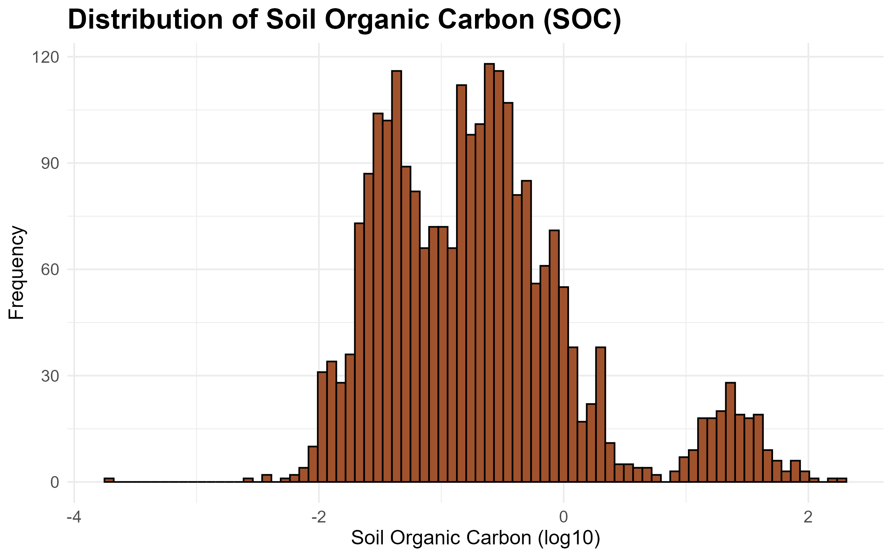

## Summary

Soils are one of the largest carbon stores on Earth, and understanding how carbon is distributed in soils is important for predicting how ecosystems respond to environmental change. This project explores how soil physical properties and climate conditions relate to soil organic carbon (SOC) using data from the ISRaD database.

One of the main findings is that SOC is not evenly distributed across soils. Instead, the data clearly separates into two groups: most soils have relatively low carbon levels, while a smaller group of organic-rich soils contain much higher amounts of carbon. This pattern appears consistently across multiple analyses, including the SOC distribution, PCA results, and the relationship between SOC and bulk density, suggesting that these two soil types behave quite differently in terms of carbon storage.

The figure below shows the SOC distribution on a log scale, where this separation between the two groups is most clearly visible.



## Motivation and Context

```{r}
#| label: do this first
#| echo: false
#| message: false

# change this to the location of your Quarto file containing your project; then delete this comment
here::i_am("Classes/SoilCarbonAnalysis.qmd")
```

Climate change is one of the most important challenges affecting ecosystems today, and I've been interested in how environmental changes influence natural carbon cycles. This project grew out of that interest, with a focus on understanding how soil carbon storage varies across different climate and soil conditions.

Soils play a major role in the global carbon cycle, and they don't behave the same way everywhere. When soils release stored carbon back into the atmosphere as carbon dioxide, it can accelerate warming, creating a feedback loop that makes climate change worse. On the other hand, soils that store more carbon act as a natural buffer against rising atmospheric CO2. What makes this especially relevant from a biological perspective is the connection between soil carbon and plant life. Soils rich in organic carbon support greater microbial diversity and nutrient availability, which directly affects plant growth and the ability of ecosystems to adapt under changing conditions. Some research suggests that warming temperatures could accelerate decomposition and reduce soil carbon in certain regions, which would not only release more carbon into the atmosphere but also degrade the soil conditions that plants depend on.

The goal of this project is to explore what physical and climate variables are most associated with soil organic carbon across a wide range of environments, a small step toward understanding how soil carbon storage might respond to a changing climate.

## Packages Used In This Analysis

```{r}
#| label: load packages
#| message: false
#| warning: false

library(here)
library(readr)
library(dplyr)
library(ggplot2)
library(rsample)
library(naniar)
library(recipes)
library(workflows)
library(parsnip)
library(tune)
library(yardstick)
library(ranger)
library(gt)
```

| Package | Use |
|----|----|
| [here](https://here.r-lib.org/) | to easily load and save data |
| [readr](https://readr.tidyverse.org/) | to import the CSV dataset |
| [dplyr](https://dplyr.tidyverse.org/) | to filter, select, mutate, and summarize data |
| [ggplot2](https://ggplot2.tidyverse.org/) | to create exploratory and informative graphs |
| [rsample](https://rsample.tidymodels.org/) | to split data into training and test sets |
| [naniar](https://naniar.njtierney.com/) | to visualize missing data patterns |
| [recipes](https://recipes.tidymodels.org/) | to preprocess data |
| [workflows](https://workflows.tidymodels.org/) | to combine recipe and models into one |
| [parsnip](https://parsnip.tidymodels.org/) | to define model types |
| [tune](https://tune.tidymodels.org/) | to find the best model settings |
| [yardstick](https://yardstick.tidymodels.org/) | to measure model performance |
| [gt](https://gt.rstudio.com/) | to create pretty tables |

## Data Description

This project uses the `ISRaD_data_flat_layer_v2.9.9.2025-08-14.csv` file from the [ISRaD (International Soil Radiocarbon Database)](https://www.soilradiocarbon.org/). ISRaD is an open-access, community-contributed database designed to improve understanding of the global soil carbon cycle using radiocarbon (carbon-14) measurements. It is maintained through collaborations including the U.S. Geological Survey Powell Center and the Max Planck Institute for Biogeochemistry, with contributions from researchers worldwide who publish and share their soil radiocarbon data.

Each observation in this dataset represents a single soil layer measurement from a specific site. The full dataset contains over 42,000 observations and 184 variables, covering things like site and ID information, soil depth structure, physical properties (such as texture and bulk density), chemical properties (like carbon, nitrogen, and pH), and radiocarbon related measurements. For this project, I selected a smaller subset of variables related to soil organic carbon, soil depth, texture, climate, and basic chemistry. After filtering to only include observations with a valid response variable (soil organic carbon), the working dataset contains 3,095 observations and 14 variables.

This data comes from Lawrence, C.R., et al. (2020), "An open-source database for the synthesis of soil radiocarbon data: International Soil Radiocarbon Database (ISRaD) version 1.0," *Earth System Science Data*, 12, 61–76. <https://essd.copernicus.org/articles/12/61/2020/>

```{r}
#| label: import data
#| warning: false
#| message: false

soil_layer <- read_csv("ISRaD_data_flat_layer_v 2.9.9.2025-08-14.csv")

soil_layer_clean <- soil_layer |>
  select(
    lyr_soc,          # soil organic carbon (response)
    lyr_top,
    lyr_bot,
    lyr_c_to_n,       # carbon-to-nitrogen ratio
    lyr_n_tot,        # total nitrogen
    lyr_c_tot,        # total carbon
    lyr_bd_samp,      # bulk density
    lyr_sand_tot_psa, # sand percent
    lyr_clay_tot_psa, # clay percent
    lyr_ph,           # soil pH
    pro_MAT,          # mean annual temperature
    pro_MAP,          # mean annual precipitation
    pro_permafrost,   # permafrost presence
    pro_land_cover    # land cover type
  ) |>
  filter(!is.na(lyr_soc))
```

## Data Wrangling

The dataset was split into training and test sets using a random 80/20 split with `initial_split()`. The training set contains approximately 2,476 observations and is used to build and tune models, while the remaining 619 observations are held out for evaluating model performance on unseen data.

```{r}
#| label: train-test split
set.seed(1017)
soil_layer_split <- initial_split(soil_layer_clean, prop = 0.8)

soil_train <- training(soil_layer_split)
soil_test  <- testing(soil_layer_split)
```

To better represent soil profile structure for modeling, two features were engineered. First, `depth_mid` converts the top and bottom depth boundaries into a single continuous value representing the midpoint of each soil layer. This allows SOC to be analyzed more smoothly across depth rather than treating layers as separate intervals. Second, `horizon_thickness` represents the thickness of each soil layer, which helps capture differences in soil horizon structure and sampling resolution.

```{r}
#| label: feature engineering
soil_train_clean <- soil_train |>
  mutate(
    # midpoint of each soil layer
    depth_mid = (lyr_top + lyr_bot) / 2,

    # thickness of the soil layer
    horizon_thickness = lyr_bot - lyr_top
  )

soil_test_clean <- soil_test |>
  mutate(
    # same transformations applied to test set to keep it consistent
    depth_mid = (lyr_top + lyr_bot) / 2,
    horizon_thickness = lyr_bot - lyr_top
  )
```

Missing data were handled using imputation rather than removing incomplete rows, since a pretty big portion of the dataset (approximately 40%) contained missing values. Deleting these observations would have reduced the dataset size and could have biased the results toward better sampled environments. Instead, median imputation was applied to numeric variables and mode imputation to categorical variables. Median imputation was chosen over mean imputation because several variables, including SOC itself, are strongly right-skewed, making the median more appropriate for representing the center of skewed distributions. However, one limitation of this method is that it compresses the distribution of the data by filling missing observations with identical values. Importantly, this process was fit using only the training data to avoid data leakage and then applied consistently to both training and test sets.

```{r}
#| label: missing data
#| warning: false

# quick check for missing values
vis_miss(soil_train_clean)
```

```{r}
#| label: imputation recipe

#lots of NAs so wanted to try imputing
# RECIPE
soil_recipe <- recipe(
  lyr_soc ~ .,   # predict SOC using all other variables
  data = soil_train_clean
) |>
  # fill missing numeric values using median
  step_impute_median(all_numeric_predictors()) |>
  
  # fill missing categorical values using most common category
  step_impute_mode(all_nominal_predictors())

# prepare recipe
soil_prep <- soil_recipe |>
  prep()

# apply transformations to training data
soil_train_imputed <- bake(soil_prep, new_data = NULL)

# apply same transformations to test data 
soil_test_imputed  <- bake(soil_prep, new_data = soil_test_clean)
```

## Exploratory Data Analysis

### Distribution of Soil Organic Carbon

Soil organic carbon (SOC) is an important variable because it represents how much carbon is stored in soils, which is a major part of the global carbon cycle. Soils store a lot of carbon and even small changes in SOC can have large implications for climate change. SOC also reflects soil health and ecosystem productivity, since higher carbon levels are often associated with more organic matter and biological activity. Because of this, understanding what controls SOC, like depth and climate, is important for figuring out where carbon is stored in ecosystems and how stable that carbon is over time.

```{r}
#| label: create-summary-table
#| warning: false

soc_summary <- soil_train |>
  summarise(
    n = sum(!is.na(lyr_soc)),
    mean = mean(lyr_soc),
    sd = sd(lyr_soc),
    min = min(lyr_soc),
    q1 = quantile(lyr_soc, 0.25),
    median = median(lyr_soc),
    q3 = quantile(lyr_soc, 0.75),
    max = max(lyr_soc)
  )
```

```{r}
#| label: display-summary-table
#| echo: false
#| warning: false

soc_summary |>
  gt() |>
  fmt_number(decimals = 3) |>
  cols_label(
    n = "N",
    mean = "Mean",
    sd = "SD",
    min = "Min",
    q1 = "Q1",
    median = "Median",
    q3 = "Q3",
    max = "Max"
  ) |>
  tab_header(
    title = md("**Summary Statistics: Soil Organic Carbon**")
  ) |>
  tab_options(
    table.width = pct(100),
    table.font.size = px(20),
    column_labels.background.color = "sienna",
    table.border.top.color = "sienna",
    table.border.bottom.color = "sienna",
    heading.title.font.size = px(20),
    data_row.padding = px(8)
  )
```

```{r}
#| label: soc-histogram
#| warning: false

ggplot(soil_train, aes(x = log10(lyr_soc))) +
  geom_histogram(bins = 80, fill = "sienna", color = "black") +
  labs(
    title = "Distribution of Soil Organic Carbon (SOC)",
    x = "Soil Organic Carbon (log10)",
    y = "Frequency"
  ) +
  theme_minimal()
```

In this dataset, soil organic carbon (SOC) is highly right-skewed, with most values concentrated at low levels (median = 0.175), while a small number of extreme observations (max = 188) increase the mean substantially (mean = 2.6). This suggests that most soil layers contain relatively low carbon content, while a small subset store very large amounts of carbon. The large standard deviation reflects this mix of fundamentally different soil environments rather than variation within a single uniform system.

Because of this strong skew, SOC was log-transformed for visualization to better display the overall distribution.

On the log scale, the distribution also shows a small separate group of observations at very high SOC values (around 1.5–2). These likely come from organic or peat soils found in places like wetlands, bogs, or permafrost regions, where waterlogged or frozen conditions slow down decomposition and allow carbon to build up over long periods of time. Because these soils behave very differently from typical mineral soils, they appear as a separate cluster rather than blending into the main pattern.

### Distribution of Soil pH

Soil pH was examined because it plays an important role in controlling soil chemistry and biological activity. pH influences microbial decomposition rates, which may affect how much organic carbon is stored in soils. More acidic conditions often slow microbial activity, which can lead to potentially higher carbon levels in some environments.

```{r}
#| label: ph summary table
#| warning: false

ph_summary <- soil_train |>
  summarise(
    n = sum(!is.na(lyr_ph)),
    mean = mean(lyr_ph, na.rm = TRUE),
    sd = sd(lyr_ph, na.rm = TRUE),
    min = min(lyr_ph, na.rm = TRUE),
    q1 = quantile(lyr_ph, 0.25, na.rm = TRUE),
    median = median(lyr_ph, na.rm = TRUE),
    q3 = quantile(lyr_ph, 0.75, na.rm = TRUE),
    max = max(lyr_ph, na.rm = TRUE)
  )
```

```{r}
#| label: ph summary display table
#| echo: false
#| warning: false

ph_summary |>
  gt() |>
  fmt_number(decimals = 3) |>
  cols_label(
    n = "N",
    mean = "Mean",
    sd = "SD",
    min = "Min",
    q1 = "Q1",
    median = "Median",
    q3 = "Q3",
    max = "Max"
  ) |>
  tab_header(
    title = md("**Summary Statistics: Soil pH**")
  ) |>
  tab_options(
    table.width = pct(100),
    table.font.size = px(20),
    column_labels.background.color = "lightgreen",
    table.border.top.color = "lightgreen",
    table.border.bottom.color = "lightgreen",
    heading.title.font.size = px(20),
    data_row.padding = px(8)
  )
```

```{r}
#| label: Layer pH Variable
#| warning: false

#histogram for layer pH
ggplot(soil_train, aes(x = lyr_ph)) +
  geom_histogram(bins = 11,
                 fill = "lightgreen",
                 color = "black",
                 na.rm = TRUE) +
labs(
  title = "Distribution of Soil pH",
  x = "Soil pH",
  y = "Count"
) +
  theme_minimal()
```

In this dataset, soil pH is generally acidic, with a mean of 4.81 and a median of 4.55. The distribution ranges from 2.9 to 7.9, indicating that most soils are acidic with a smaller number of more neutral soils. The small standard deviation (1.03) suggests that while there is variation in soil chemistry, most observations fall within the acidic range.

### SOC vs Mean Annual Temperature

The relationship between mean annual temperature (MAT) and soil organic carbon (SOC) was explored using a scatterplot with log-transformed SOC values. Temperature is expected to affect SOC through its influence on microbial decomposition, where warmer conditions generally speed up decomposition and lead to lower carbon storage.

However, instead of a smooth trend, the plot shows clear vertical bands at specific temperature values. This happens because of how the ISRaD dataset is structured. For example, multiple soil layers from the same site that share the same MAT, so the data naturally stacks at a limited number of temperature points. Within each site, SOC can vary a lot with depth, which creates the vertical spread.

Because of this structure, the smooth trend line is mostly averaging across site clusters rather than showing a true continuous relationship with temperature. As a result, it’s hard to make strong conclusions about MAT as a standalone driver of SOC from this plot alone. More likely, SOC is influenced by a mix of factors such as ecosystem type, vegetation input, moisture conditions, and soil depth.

```{r}
#| label: SOC vs MAT
#| warning: false

ggplot(soil_train, aes(x = pro_MAT, y = log10(lyr_soc))) +
  geom_point(alpha = 0.25, color = "blueviolet") +
  geom_smooth(method = "loess", color = "red3", se = F)+
  labs(
    title = "SOC vs Mean Annual Temperature",
    x = "Mean Annual Temperature (C)",
    y = "SOC (log scale)"
  )+
  theme_minimal()
```

### SOC vs Bulk Density

Bulk density describes how compact a soil is. Lower values usually indicate more porous, organic-rich soils, while higher values tend to reflect more compact mineral soils. For the main group of soils, SOC is highest around a bulk density of about 0.3–0.5 g/cm\^3 and gradually decreases as soils become more compact. This makes sense, since denser soils are typically more mineral rich and have less space for organic matter.

However, the overall pattern is more complicated than the trend line suggests. There is a separate group of high SOC values spread across almost all bulk density levels. These likely correspond to organic or peat soils, similar to what was seen in the SOC distribution. In these environments, high carbon levels are mainly driven by slow decomposition rather than soil structure, so they do not follow the same pattern as typical mineral soils.

Because of this, the smooth trend is mostly influenced by the main mineral soil group and does not represent the high SOC cluster very well.

```{r}
#| label: SOC vs Bulk Density
#| warning: false

#Higher bulk density means more compact soil means less SOC space

ggplot(soil_train, aes(x = lyr_bd_samp, y = log10(lyr_soc))) +
  geom_point(alpha = 0.5, color = "cyan3") +
  geom_smooth(method = "loess", color = "red3", se = F) +
  labs(
    title = "Soil Organic Carbon vs Bulk Density",
    x = "Bulk Density (g/cm^3)",
    y = "SOC (log scale)"
  ) +
  theme_minimal()
```

## Modeling (PCA)

Principal Component Analysis (PCA) is a way to simplify a dataset that has a lot of variables that are related to each other. In this soil data, things like carbon, nitrogen, texture, pH, and climate are often connected, so instead of looking at each one separately, PCA combines them into a smaller number of new variables.

These new variables are called principal components. Each principal component is a weighted combination of the original variables. The first component (PC1) is constructed to capture as much variation in the data as possible, meaning it represents the strongest overall pattern. The second component (PC2) captures the next strongest pattern, but it is built to be independent of PC1. This continues for additional components, but each one explains less variation than the previous one.

Before running PCA, all variables are normalized so they are on the same scale. This matters because PCA is based on variation, and variables with bigger numerical ranges would otherwise dominate the results just because of units.

In this project, PCA is used to reduce many soil and climate variables into a few main “summary axes” so the overall patterns can be understood easily. The first two components are typically enough because they capture most of the structure in the data, and after that the added information becomes much smaller.

```{r}
#| label: Principal Component Analysis (PCA)

# PCA used to reduce many correlated variables into a smaller set of COMPONENTS that capture most of the variation

pca_recipe <- recipe(lyr_soc ~ ., data = soil_train_imputed) |>
  
  # remove categorical variables not suitable for PCA
    # they gave me errors since they only had one level
  step_rm(pro_land_cover, pro_permafrost) |>
  
  # standardize variables so they are on the same scale
  #pca is sensitive
  step_normalize(all_numeric_predictors()) |>
  
  # create principal components from numeric predictors
  # num_comp = 5 keeps the first 5 components
  step_pca(all_numeric_predictors(), num_comp = 5)

# fit PCA on training data
pca_prep <- pca_recipe |>
  prep()

# apply PCA transformation to training data
pca_baked <- bake(pca_prep, new_data = NULL)
```

### Variance Explained

The scree plot shows that most of the variation in the soil data is explained by the first few principal components. PC1 explains the most (\~26%), followed by PC2 (\~18%) and PC3 (\~16%) and so on and so forth. Together the first three components capture around 60% of the total variation. After that, the curve starts to level off around PC4, at the “elbow” point, meaning each additional component adds less new information. Overall, this suggests that the important structure of the soil data can be summarized with just a few components, while the later ones mostly capture noise instead of stronger patterns.

```{r}
#| label: scree plot (variance explained)

# extract how much variance each principal component explains
pca_pve <- tidy(pca_prep, 3, type = "variance")

# scree plot toshow how much information each PC captures
ggplot(pca_pve |> filter(terms == "percent variance"),
       aes(x = component, y = value)) +
  geom_point() +
  geom_line() +
  labs(
    x = "Principal Components",
    y = "Percent Variance Explained",
    title = "Scree Plot for Soil PCA"
  )
```

### Variable Loadings

The loading values show how much each original soil variable contributes to the first two principal components. Variables with values farther from zero have a stronger influence on that component, while values close to zero don’t really matter much for that axis.

PC1 mainly reflects a depth gradient. The strongest contributions come from lyr_top, lyr_bot, and depth_mid, all with large negative loadings. This means PC1 is mostly separating shallow soil layers from the deeper soil layers. Horizon thickness also plays a role, but it’s not as strong as the main depth variables.

PC2 reflects a mix of climate and soil chemistry. Mean annual temperature and precipitation load positively on this component, meaning warmer and wetter conditions push PC2 higher. In contrast, total carbon and total nitrogen load negatively, meaning higher nutrient-rich soils tend to fall lower on this axis. So overall, PC2 seems to capture a trade-off between climate conditions and soil fertility, where warmer/wetter environments are associated with lower carbon and nitrogen storage.

```{r}
#| label: PCA loadings

# shows which original variables contribute most to each PC
pca_loadings <- tidy(pca_prep, 3, type = "coef")

# visualize of top drivers of PC1 and PC2
pca_loadings |>
  filter(component %in% c("PC1", "PC2")) |>
  ggplot(aes(x = value, y = terms, fill = abs(value))) +
  geom_col() +
  facet_wrap(~component) +
  scale_fill_gradient(low = "#7B68EE", high = "#FF69B4") +
  theme_minimal()
```

### PCA Score Plot

The score plot shows each soil sample positioned based on the first two principal components. PC1 (horizontal axis) mainly reflects soil depth, with samples further to the left representing deeper soil layers. PC2 (vertical axis) captures a climate–soil chemistry gradient, where higher values are associated with warmer and wetter conditions, while lower values tend to correspond to more carbon- and nutrient-rich soils.

The streak-like patterns in the plot likely come from how the original variables are structured. PCA works best when variables are more continuously distributed, but several variables here are bounded, such as sand and clay percentages that are constrained between 0 and 100. This leads to many repeated or clustered values, which can create the visible lines and banding in the score plot.

```{r}
#| label: PCA score plot
# each point is a soil sample projected into PC1 and PC2 space
ggplot(pca_baked, aes(x = PC1, y = PC2, color = log10(lyr_soc))) +
  geom_point(alpha = 0.6, size = 1.5) +
  scale_color_gradient(low = "#7B68EE", high = "#FF69B4", name = "SOC (log10)") +
  labs(
    title = "PCA Score Plot of Soil Properties",
    x = "PC1 (Depth Gradient)",
    y = "PC2 (Climate vs Soil Chemistry)"
  ) +
  theme_minimal()
```

Looking at the outliers helps check whether the most extreme points in the PCA space actually make sense in terms of real soil conditions, rather than just being caused by these data constraints.

```{r}
#| label: pca-outlier-check

# need to add back the original variables to interpret the outliers
pca_baked_check <- pca_baked |>
  # add row numbers so can ID which observation each point is
  mutate(row = row_number()) |>
  # bring back the original variables for interpretation
  bind_cols(soil_train_imputed |> select(lyr_top, lyr_bot, depth_mid, pro_MAT, pro_MAP))

# PC1 outliers: points far to the LEFT on the score plot
# threshold of PC1 < -12 captures only the most extreme points
pc1_outliers <- pca_baked_check |>
  filter(PC1 < -12) |>
  # keep only the columns for checking depth
  select(row, PC1, PC2, lyr_soc, lyr_top, lyr_bot, depth_mid)

# PC2 outliers: points at the TOP of the score plot
# threshold PC2 > 4 captures only the most extreme points
pc2_outliers <- pca_baked_check |>
  filter(PC2 > 4) |>
  # keep only the columns for checking climate
  select(row, PC1, PC2, lyr_soc, pro_MAT, pro_MAP)
```

**PC1 Outliers (Deepest Soil Layers):** The two points furthest left on PC1 correspond to very deep soil layers, with depth midpoints of 436 and 498 cm, the deepest observations in the dataset. Both have very low SOC (around 0.013), which is what we would expect at these depths since organic matter is mostly absent in deep mineral soil layers. This supports what the loadings suggested: PC1 is separating shallow, carbon-rich surface soils from deeper, carbon-poor soils.

```{r}
#| label: pc1-outlier-table
#| echo: false
#| warning: false

pc1_outliers |>
  select(row, PC1, PC2, lyr_soc, depth_mid) |>
  gt() |>
  fmt_number(decimals = 3) |>
  cols_label(
    row = "Row",
    PC1 = "PC1",
    PC2 = "PC2",
    lyr_soc = "SOC",
    depth_mid = "Depth Midpoint (cm)"
  ) |>
  tab_header(title = md("**Extreme PC1 Outliers: Deepest Soil Layers**")) |>
  tab_options(
    table.width = pct(100),
    table.font.size = px(14),
    column_labels.background.color = "#7B68EE",
    table.border.top.color = "#7B68EE",
    table.border.bottom.color = "#7B68EE",
    heading.title.font.size = px(16),
    data_row.padding = px(8)
  )
```

**PC2 Outliers (Tropical Climate Soils):** The cluster at the top of PC2 corresponds to soils from very warm and wet environments, with mean annual temperatures around 26°C and precipitation above 2,500 mm, typical of tropical rainforest regions. Most of these soils have relatively high SOC values (21–39), which makes sense given the high plant productivity and large amounts of organic input in these climates.

However, one observation (row 106) stands out, with very low SOC (0.235) despite being from an extremely wet location (about 3,800 mm of rainfall). This highlights that while PC2 captures broad climate conditions, it does not directly determine SOC aka high carbon levels are common in these environments, but not guaranteed.

```{r}
#| label: pc2-outlier-table
#| echo: false
#| warning: false

pc2_outliers |>
  select(row, PC1, PC2, lyr_soc, pro_MAT, pro_MAP) |>
  head(10) |>
  gt() |>
  fmt_number(decimals = 3) |>
  cols_label(
    row = "Row",
    PC1 = "PC1",
    PC2 = "PC2",
    lyr_soc = "SOC",
    pro_MAT = "MAT (°C)",
    pro_MAP = "MAP (mm)"
  ) |>
  tab_header(title = md("**Extreme PC2 Outliers: Tropical High SOC Soils**")) |>
  tab_options(
    table.width = pct(100),
    table.font.size = px(14),
    column_labels.background.color = "#FF69B4",
    table.border.top.color = "#FF69B4",
    table.border.bottom.color = "#FF69B4",
    heading.title.font.size = px(16),
    data_row.padding = px(8)
  )
```

Overall, both outlier checks appear consistent with expectations. The extreme positions in PCA space correspond to real, interpretable environmental conditions rather than data errors or modeling artifacts. This supports the idea that the PCA is capturing meaningful structure in the soil data.

## Conclusion

This project set out to understand how soil physical properties and climate conditions relate to soil organic carbon (SOC) storage. As seen throughout the EDA and PCA results, SOC is not driven by a single factor — depth, climate, and ecosystem type all play a role, and the relationships between them are complex and nonlinear.

The most consistent finding across analyses was the separation between two distinct soil populations: typical mineral soils with low carbon content, and organic-rich environments that store substantially more. This distinction showed up in the SOC distribution, the bulk density scatterplot, and the PCA score plot, suggesting these two groups operate under fundamentally different carbon cycling processes and may need to be treated separately in future modeling work.

### Limitations and Future Work

#### Missing data and imputation

A key limitation of this analysis is the use of median imputation to handle missing data. With approximately 40% of observations containing missing values, removing incomplete rows was not feasible. However, replacing missing values with the median reduces the natural variability in the data. This may affect model performance by making some predictors appear more uniform than they actually are, potentially underestimating their true importance. Future work could explore more different methods such as k-nearest neighbors.

#### Two distinct soil populations

Another limitation is that the dataset combines two very different soil types: typical mineral soils and high-carbon organic soils. A single model may struggle to accurately represent both groups, since the relationships between predictors and SOC likely differ between them. Future work could explore building separate models for each soil type, or adding a classification variable to distinguish organic-rich environments.

#### Sampling and geographic bias

Because ISRaD is compiled from individual research studies, it is not a random or fully representative sample of global soils. Certain regions, ecosystems, and depth ranges are overrepresented depending on where sampling has historically occurred. This is visible in the data structure, where observations cluster at specific temperature values rather than forming a smooth distribution. As a result, model performance and generalizability may be limited in underrepresented environments such as tropical forests or arid regions.

#### Variable selection bias in PCA

A further limitation of the PCA analysis is that the variables included were intentionally selected to represent soil depth and climate gradients. As a result, the first two principal components largely reflect structure that was expected from the beginning, rather than uncovering entirely new patterns in the data. With 14 curated variables focused on depth and climate, PCA is effectively constrained to organize variation along those dimensions. A more exploratory approach could include a broader range of variables, such as biological activity, land use history, or mineralogical composition, which may reveal additional or unexpected structure.
